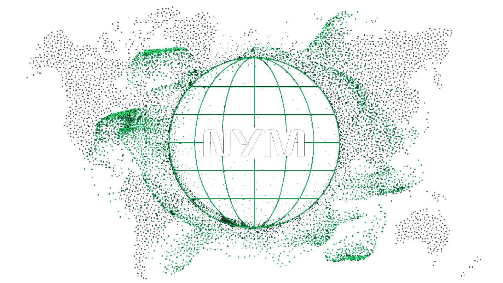
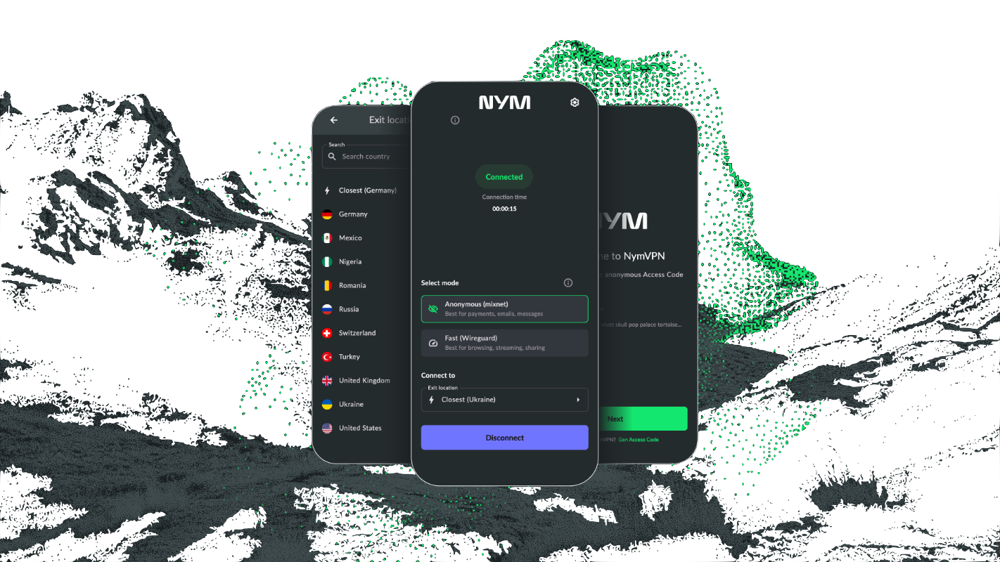

Fully open source, multi-hop, decentralized VPN.

# NymVPN

The NymVPN is a VPN-like app built on [Nym's signature, decentralized mixnet](https://nym.com/mixnet), offering the following core [features](https://nym.com/features):
- Anonymous 5-hop mixnet mode
- Fast 2-hop [WireGuard](https://www.wireguard.com/)-based decentralized VPN mode with [Amnezia](https://amnezia.org/) censorship resistence
- Private credentials using zk-nyms (zero-knowledge proofs)

This monorepo contains all of our source code for our NymVPN client apps (iOS / Android / Linux / macOS / Windows / CLI), separate from the Nym network [monorepo](https://github.com/nymtech/nym). 

 

 

[](https://apps.obtainium.imranr.dev/redirect?r=obtainium://app/%7B%22id%22%3A%22net.nymtech.nymvpn%22%2C%22url%22%3A%22https%3A%2F%2Fgithub.com%2Fnymtech%2Fnym-vpn-client%22%2C%22author%22%3A%22nymtech%22%2C%22name%22%3A%22NymVPN%22%2C%22preferredApkIndex%22%3A0%2C%22additionalSettings%22%3A%22%7B%5C%22includePrereleases%5C%22%3Afalse%2C%5C%22fallbackToOlderReleases%5C%22%3Atrue%2C%5C%22filterReleaseTitlesByRegEx%5C%22%3A%5C%22%5C%22%2C%5C%22filterReleaseNotesByRegEx%5C%22%3A%5C%22%5C%22%2C%5C%22verifyLatestTag%5C%22%3Afalse%2C%5C%22dontSortReleasesList%5C%22%3Afalse%2C%5C%22useLatestAssetDateAsReleaseDate%5C%22%3Afalse%2C%5C%22releaseTitleAsVersion%5C%22%3Afalse%2C%5C%22trackOnly%5C%22%3Afalse%2C%5C%22versionExtractionRegEx%5C%22%3A%5C%22%5C%22%2C%5C%22matchGroupToUse%5C%22%3A%5C%22%5C%22%2C%5C%22versionDetection%5C%22%3Afalse%2C%5C%22releaseDateAsVersion%5C%22%3Afalse%2C%5C%22useVersionCodeAsOSVersion%5C%22%3Afalse%2C%5C%22apkFilterRegEx%5C%22%3A%5C%22%5C%22%2C%5C%22invertAPKFilter%5C%22%3Afalse%2C%5C%22autoApkFilterByArch%5C%22%3Atrue%2C%5C%22appName%5C%22%3A%5C%22%5C%22%2C%5C%22shizukuPretendToBeGooglePlay%5C%22%3Afalse%2C%5C%22allowInsecure%5C%22%3Afalse%2C%5C%22exemptFromBackgroundUpdates%5C%22%3Afalse%2C%5C%22skipUpdateNotifications%5C%22%3Afalse%2C%5C%22about%5C%22%3A%5C%22%5C%22%2C%5C%22refreshBeforeDownload%5C%22%3Afalse%7D%22%2C%22overrideSource%22%3Anull%7D)

## Roadmap

Check out our [public roadmap](https://trello.com/b/qVhBo3e2/nymvpn-public-roadmap) to see what is coming next.

## Support

For help, visit our [Help Center](https://support.nym.com/hc/en-us) or contact our [Support team](https://support.nym.com/hc/en-us/requests/new) with any questions about NymVPN.

For the latest announcements and articles on privacy and security, visit [Nym's blog](https://nym.com/en/blog).

## Acknowledgements

[Mullvad open source libraries](https://github.com/mullvad/mullvadvpn-app/) to handle setting up local routing and wrapping wireguard-go.

[Amnezia wg-go open source library](https://github.com/amnezia-vpn/amneziawg-go) to help prevent censorship of WireGuard.

## Community

Connect with the community on our socials.

## Contributing

Find out the various ways [you can
contribute](CONTRIBUTING.md).
